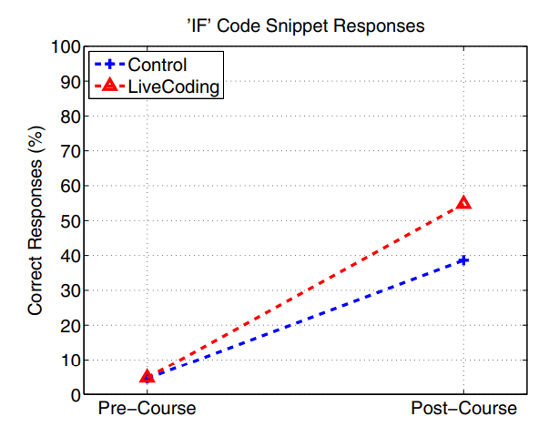
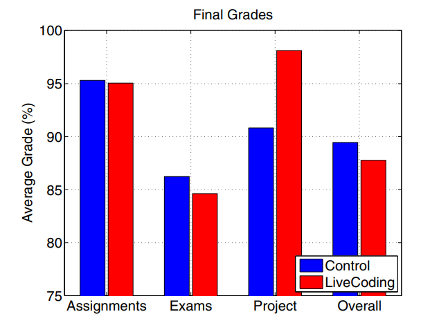

## Solution
Create a program/application that allows for live-time coding. The app will have different roles, administrator and member. Administrators have overseeing powers and will be able to modify member’s codes if they see necessary. This way, instructors can give out practice problems and observe what each student needs while coding. The application/program will have a one-on-one question system, where students ask the instructor a question privately. Sometimes students feel embarrassed to ask questions in front of the whole class. Thus, this system will also help the teaching process and make sure students understand what they are doing. The instructor will also be able to see each student’s screens through the program, almost like other communication programs like Zoom. However, the instructors will see the student’s screen and will be able to interact with it.

In addition to having the program afford interacting between instructors and students, it is also important that it affords interacting between students and other students. Paired coding is an important feature as pairing “bolsters course completion and consequently course pass rates, and contributes to greater persistence in computer science-related majors.”[[1]](#1) For peer-to-peer cases, all of the peers will have the administrator role. They will be able to edit, review, and leave feedback to other peer’s codes. All of this will be done in real-time, and users will be able to use this program efficiently with all of the tools provided. Collaborative coding process will definitely become easier with the implementation of this tool.

An important facet of this program is that it has the necessary collection of features, while still remaining visually uncomplicated. When students view the instructor’s coding window, it should not be very different from the student’s own coding window. Keeping this sort of consistency and familiarity between these two views prevents adding any complexity to the learning process. This type of precaution aids in reducing the “extraneous cognitive load.”[[2]](#2)
### Measuring Success
To test effectiveness of our prototype, we can use methods similar to those used in previous studies on the effectiveness of live coding[[3]](#3): 

We  have two groups of students in programming learning sessions, one with our solution software, and the other group using a static learning environment. We administer a test before the learning session to get a baseline measurement of the students’ programming knowledge as well as a survey on students’ preferences in learning styles. After the learning sessions, we administer the same assessments to measure the difference in knowledge gained as well as any change in student preferences. These assessments allow us to consider numerical data from differences in test scores as well any change in sentiment towards live coding learning environments, both of which are important factors in judging the success of the solution.

### References
<a id="1">1.</a>
Charlie McDowell, Linda Werner, Heather E. Bullock, and Julian Fernald. 2006. Pair programming improves student retention, confidence, and program quality. Commun. ACM 49, 8 (August 2006), 90–95. https://doi-org.proxy-remote.galib.uga.edu/10.1145/1145287.1145293

<a id="2">2.</a>
Sweller, J., van Merriënboer, J.J.G. & Paas, F. Cognitive Architecture and Instructional Design: 20 Years Later. Educ Psychol Rev 31, 261–292 (2019). https://doi.org/10.1007/s10648-019-09465-5

<a id="3">3.</a>
Marc J. Rubin. 2013. The effectiveness of live-coding to teach introductory programming. In Proceeding of the 44th ACM technical symposium on Computer science education (SIGCSE '13). Association for Computing Machinery, New York, NY, USA, 651–656. https://doi-org.proxy-remote.galib.uga.edu/10.1145/2445196.2445388
