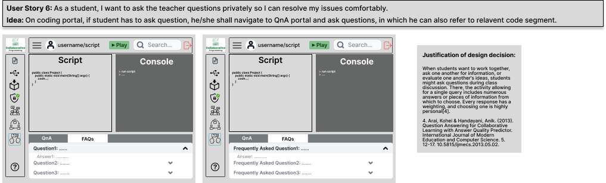

## Detailed design
In this section we will provide detailed design view of our system.

### User Stories
1. As a teacher, I want to be able to create a team and collaborate with my classmates in a group.
2. As a teacher, I want to be able to put comments for students individually or for the whole class.
3. As a teacher, I want to be able to see all of the student's screens so I can monitor their progress and see if part of the assignment needs clarification.
4. As a programmer working for a company, I want to be able to share my work with my coworkers so that we can work on project together at the same time, offering feedback and comments.
5. As a student, I want to ask the teacher questions privately so I can resolve my issues comfortably.
6. As a student, I want to see my instructor's comments in real-time on my code so that I can improvise my code accordingly.

### Mockups
#### UserStory 1. As a teacher, I want to be able to create a team and collaborate with my classmates in a group.

#### UserStory 2. As a teacher, I want to be able to put comments for students individually or for the whole class.

#### UserStory 3. As a teacher, I want to be able to see all of the student's screens so I can monitor their progress and see if part of the assignment needs clarification.

#### UserStory 4. As a programmer working for a company, I want to be able to share my work with my coworkers so that we can work on project together at the same time, offering feedback and comments.

#### UserStory 5. As a student, I want to ask the teacher questions privately so I can resolve my issues comfortably.

#### UserStory 6. As a student, I want to see my instructor's comments in real-time on my code so that I can improvise my code accordingly.

We have created mockups on Figmar which can be accessed by clicking [here](https://www.figma.com/file/Eyoiz34vwYfzsJxiirrIC0/Wireframes_SCP?node-id=9%3A159)

#### Content
- [User Experience Requirements](requirements.md)
- [Ideation and Preliminary Designs](ideation.md)
- [Detailed Design](design.md)
- [Summary Video](demo.md)
