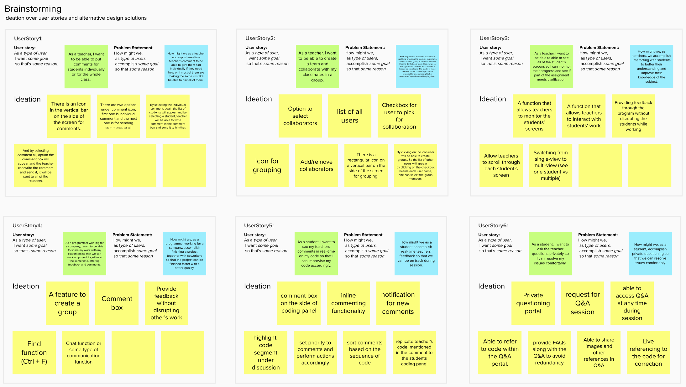
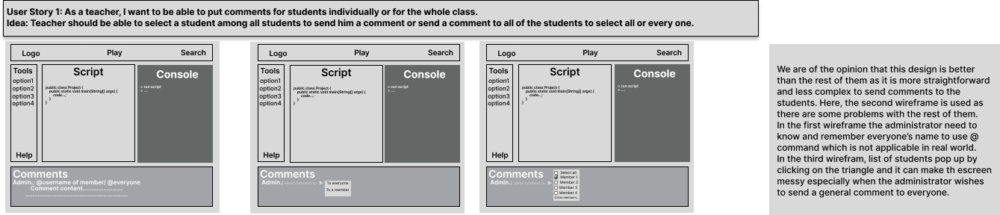
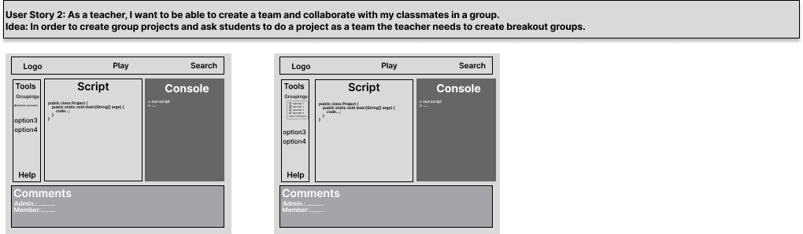
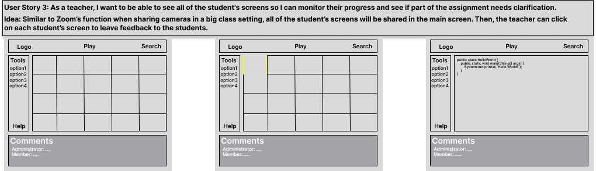
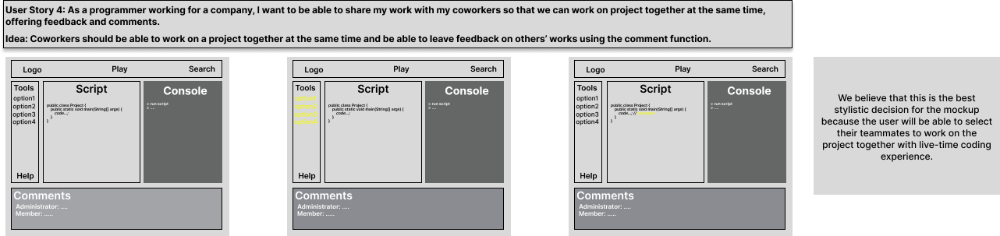
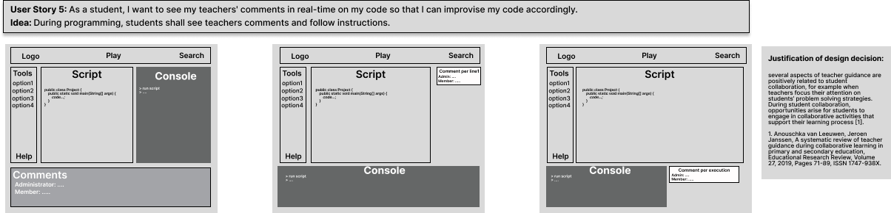
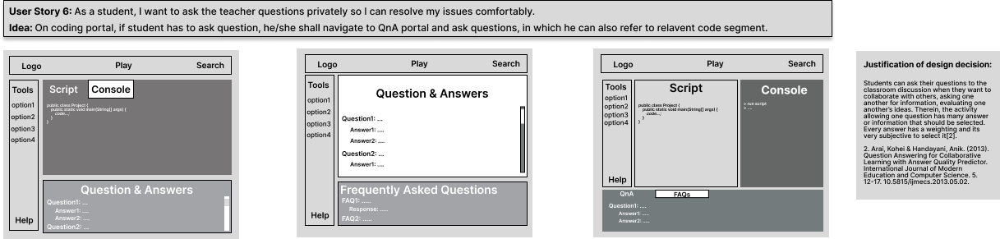

## Ideation and Preliminary Designs
In this section we will provide ideation for our relavent user stories.

### Relavent User Stories
1. As a teacher, I want to be able to create a team and collaborate with my classmates in a group.
2. As a teacher, I want to be able to put comments for students individually or for the whole class.
3. As a teacher, I want to be able to see all of the student's screens so I can monitor their progress and see if part of the assignment needs clarification.
4. As a student, I want to ask the teacher questions privately so I can resolve my issues comfortably.
5. As a student, I want to see my instructor's comments in real-time on my code so that I can improvise my code accordingly.
6. As a programmer working for a company, I want to be able to share my work with my coworkers so that we can work on project together at the same time, offering feedback and comments.

### Ideation

[Link to mural](https://app.mural.co/invitation/mural/livesynchronousprogramming4296/1657919665995?sender=u461392fd5388f2182c227778&key=7c724e4c-9a52-40e8-be36-abe24543fc0c)

### Best Ideas
#### UserStory 1. As a teacher, I want to be able to create a team and collaborate with my classmates in a group
1. There is a rectangular icon on a vertical bar on the side of the screen for grouping.
2. By clicking on the icon user will be bale to create groups. So the list of other users will appear by clicking on the checkbox beside each user name, one can select the group members.

#### UserStory 2. As a teacher, I want to be able to put comments for students individually or for the whole class.
1. There is an icon in the vertical bar on the side of the screen for comments.
2. By selecting the individual comment, again the list of students will appear and by selecting a student, teacher will be able to write comment in the comment box and send it to him/her.

#### UserStory 3. As a teacher, I want to be able to see all of the student's screens so I can monitor their progress and see if part of the assignment needs clarification.
1. A function that allows teachers to monitor the students' screens.
2. Providing feedback through the program without disrupting the students while working.

#### UserStory 4. As a student, I want to ask the teacher questions privately so I can resolve my issues comfortably.
1. Comment box on the side of coding panel.
2. Replicate teacher's code, mentioned in the comment to the students coding panel.
3. highlight  code segment under discussion.

#### UserStory 5. As a student, I want to see my instructor's comments in real-time on my code so that I can improvise my code accordingly.
1. Private questioning portal.
2. provide FAQs along with the Q&A to avoid redundancy.
3. Able to share images and other references in Q&A.

#### UserStory 6. As a programmer working for a company, I want to be able to share my work with my coworkers so that we can work on project together at the same time, offering feedback and comments.
1. Provide feedback without disrupting other's work.
2. Chat function or some type of communication function.

### Preliminary Designs
We have created wireframes on Figmar which can be accessed by clicking [here](https://www.figma.com/file/Eyoiz34vwYfzsJxiirrIC0/Wireframes_SCP?node-id=0%3A1).

#### Content
- [User Experience Requirements](requirements.md)
- [Ideation and Preliminary Designs](ideation.md)
- [Detailed Design](design.md)
- [Summary Video](demo.md)
