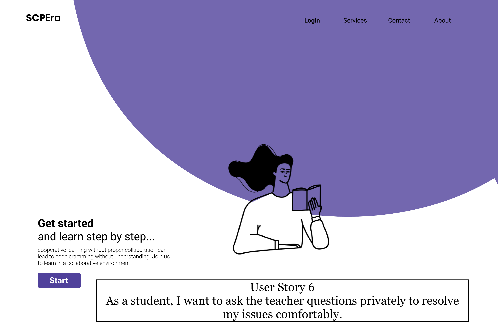

## High Fidelity Prototype
In this section we will provide whole view of prototype of our working system.
### User Stories
We will provide functioning prototype of our system with the help of explanatory demonstration videos for following user stories.

1. As a teacher, I want to be able to create a team and collaborate with my classmates in a group.
2. As a teacher, I want to be able to put comments for students individually or for the whole class.
3. As a teacher, I want to be able to see all of the student's screens so I can monitor their progress and see if part of the assignment needs clarification.
4. As a programmer working for a company, I want to be able to share my work with my coworkers so that we can work on project together at the same time, offering feedback and comments.
5. As a student, I want to see my instructor's comments in real-time on my code so that I can improvise my code accordingly.
6. As a student, I want to ask the teacher questions privately so I can resolve my issues comfortably.

### Link to Figma
We have created prototypes on Figma which can be accessed by clicking [here](https://www.figma.com/file/z675NkmgQ8T38kjY1qn77O/SCP-Prototype?node-id=55%3A0)

### Prorotypes
#### UserStory 1
**Statement** As a teacher, I want to be able to create a team and collaborate with my classmates in a group.

**Description** Teacher should be able to select a student among all students to send him a comment or send a comment to all of the students to select all or every one. 
To restate this userstory based on the prototype design, first let me mention the userstory's goal. The traget is, as a teacher or administrator be able to give the users hint individually if they need help or if most of them are making the same mistake be able to hint all of them. To achieve this goal there is a cooment box on the bottom of the page in the prototype by clicking on the text field admin. woul dbe able to select betwwen sending a comment to all users or just to a specific one. By selecting to every one th emessage will be sent to every one and on the comment box it is marked that the comment is being sent to everyone and by selecting to a member, th eadmin. will be able to select that specific person among all users by seeing all users and clicking on th echeckbox besides each username and then click on ok and the message will be send to that specific member. If after deciding to send a message to a specific user the admin changes his mind and rather to send the message to all he can click on the text field in the comment box again and he can click on to everyone button so the message will be send to all. This is how this userstory is implemented and how it gives the admin the oppurtunity to either send comment to individual members or to everyone. 

#### UserStory 2
**Statement** As a teacher, I want to be able to put comments for students individually or the whole class.

**Description** In order to create group projects and ask students to do a project as a team the teacher needs to create breakout groups. 
To restate this userstory based on the prototype design, first let me mention the userstory's goal. The traget is, as a teacher or administrator be able to assign a project to each group of students and ask them to do that as a team. Also, I want to form groups of students and consider a leader for each team. The leader is more talented in that course/topic  and is responsible for answering his/her teammates' questions and helping them. To reach this goal there is a button on the left hand side bar for teams. By clicking on this icon the admin. would be able to see the list of the users and through the checkboxes located besides each username he would be able to select a number of students to put them in a team. Then by clicking on OK button he will be asked to consider a name for the group and at last by clicking on the OK button the group is created. Again by clicking in the team icon again, the admin. would be able to craete another team by passing the same process. This is how the teacher or admin. be able to group students to enable them to work as a team.

#### UserStory 3
**Statement** As a teacher, I want to see all of the student's screens to monitor their progress and see if part of the assignment needs clarification.

**Description** Similar to Zoom’s function when sharing cameras in a big class setting, all of the student’s screens will be shared in the main screen. Then, the teacher can click on each student’s screen to leave feedback to the students.

#### UserStory 4
**Statement** As a programmer working for a company, I want to share my work with my coworkers so that we can work on projects together while offering feedback and comments.

**Description** Coworkers should be able to work on a project together at the same time and be able to leave feedback on others’ works using the comment function.

#### UserStory 5
**Statement:** As a student, I want to see my instructor's comments in real-time on my code so that I can improvise my code accordingly.

**Description** During programming, students shall see teachers comments and follow instructions, prototype has comment section which is visible to each student where all class members including teacher can discuss about specific prorgamming problem. System allows them to reference code lines for discussion in the comment section.

#### UserStory 6
**Statement** As a student, I want to ask the teacher questions privately so I can resolve my issues comfortably.

**Description** On the coding portal, if the student has to ask questions, they shall navigate to the QnA portal and ask questions, in which he or they can also refer to the relevant code segment. Suppose a student requires more attention or hesitated about something to ask in a group. In that case, he shall use the QnA portal to ask privet questions. the system allows users to ask questions synchronously during the course sessions.

**Demo**

### Disclaimer
Our prorotype components are built by oruselves, only small portions of original, copyrighted works are being used without explicit authorization and those could not be used easily to duplicate the original works. This should constitute a “fair use” of any such copyrighted material (referenced and provided for in section 107 of the US Copyright Law). If a user (“user” or “you”) wishes to use any copyrighted material from this site for purposes of their own that go beyond “fair use”, then they must obtain expressed permission from the current copyright owner.

#### Content
- [High Fidelity Prototype](prototype.md)
- [Testing Protocol](protocol.md)
- [Summary Video](demo.md)
